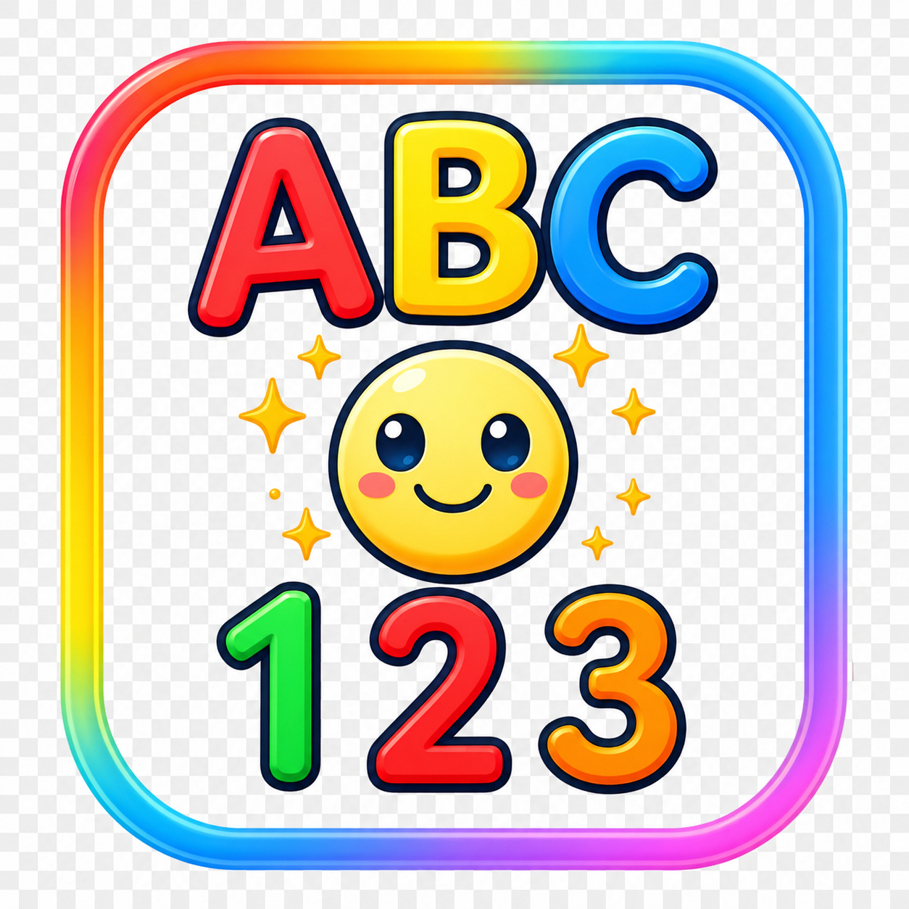

# TapPico

<p align="center">
  
</p>

<p align="center">
  <b>Tap • Learn • Grow</b><br>
  A colorful, interactive early-learning app for children ages 2–6.
</p>

<p align="center">
  
  
  
</p>

---

## Overview

TapPico is an ad-supported kids educational app that makes early learning fun and engaging. Every tap triggers playful animations, sound effects, and friendly text-to-speech narration — helping children build vocabulary, letter recognition, number sense, and category awareness through repetition and play.

**Developer:** Vedica Labs (Karnataka, India)<br>
**Package:** `com.vedica.labs.ind.app.tappico`

---

## Features

### 📚 Learning Categories (208+ items)

| Category | Items | Screen Layout |
|----------|-------|---------------|
| 🔤 Alphabets | 26 (A–Z) | 2-column grid, letter + word + emoji |
| 🔢 Numbers | 20 (1–20) | 2-column grid, dots for 1–5, emoji for 6+ |
| ⬛ Shapes | 9 | 2-column grid, CustomPaint rendered |
| 🍎 Fruits | 20 | Row layout |
| 🐦 Birds | 14 | Row layout |
| 🐕 Domestic Animals | 16 | Row layout with section header |
| 🦁 Wild Animals | 31 | Row layout with section header |
| 🐛 Insects | 11 | Row layout with section header |
| 🎨 Colors | 9 | Row layout |
| 🚗 Vehicles | 20 | Row layout |
| 🖐️ Body Parts | 19 | Row layout |
| 🥦 Vegetables | 13 | Row layout |

### 🎮 Interactive Experience

- **Tap to Learn** — Every card is tappable. Tap any item to hear its name spoken aloud in a friendly voice.
- **Tap Overlay** — A full-screen animated card with emoji and name appears on every tap, then auto-dismisses.
- **Haptic Feedback** — Light vibration on taps and toggles for tactile engagement.

### 🧠 Practice / Quiz Engine

- 13 quiz categories covering all learning content
- 4-option multiple choice questions
- Score tracking with percentage and progress bar
- Animated feedback — green for correct, red for wrong (with retry)
- Encouraging TTS feedback: *"Correct! Great job!"* / *"Try again!"*

### 🔊 Text-to-Speech

- `flutter_tts` engine for text-to-speech
- Adjustable speech speed (Slow / Normal / Fast)
- Speech queue for sequential playback
- Single characters get "... " suffix for clarity

### ⚙️ Settings

| Setting | Description |
|---------|-------------|
| Sound Effects | Toggle all audio on/off |
| Voice Speed | Slider (0.2–0.9) with Slow / Normal / Fast presets |

| Eye Protector | Amber color filter across the entire app to reduce blue light |

### 🎨 Visual Design

- **Material 3** with vivid green seed color and lavender-white background
- **Nunito** font in 4 weights (Regular, Bold, ExtraBold, Black)
- **15 category gradients** — each screen has a unique gradient header
- **Animated page transitions** — fade + scale (280ms)
- **BouncingScrollPhysics** throughout for a playful feel
- **RepaintBoundary** on every grid item for performance

### 🔄 Persistence

All user preferences are saved via `SharedPreferences`:
- Sound enabled / disabled
- Speech rate

- Eye protector mode

---

## Screens

| Screen | Description |
|--------|-------------|
| 🎬 Splash | 3-second animated intro with floating emoji, gradient loop, TTS initialization |
| 🏠 Home | 2-column category grid, time-based greeting, quick stats fun facts |
| 📖 Category Screens (13) | One screen per category with tappable learning cards |
| ❓ Practice | Category selector + 4-option MCQ quiz with scoring and feedback |
| ⚙️ Settings | Audio, voice, visual settings, version info, privacy policy |
| 📄 Privacy Policy | Full markdown-rendered privacy policy (11 sections) |

---

## Tech Stack

| Layer | Technology |
|-------|-----------|
| Framework | [Flutter](https://flutter.dev) (SDK ^3.11) |
| State Management | [Riverpod](https://riverpod.dev) ^3.3.1 |
| Text-to-Speech | [flutter_tts](https://pub.dev/packages/flutter_tts) ^4.0.2 |

| Audio Playback | [audioplayers](https://pub.dev/packages/audioplayers) ^6.6.0 |
| Animations | [flutter_animate](https://pub.dev/packages/flutter_animate) ^4.5.0 |
| Fonts | [Google Fonts](https://pub.dev/packages/google_fonts) (Nunito) |
| Persistence | [SharedPreferences](https://pub.dev/packages/shared_preferences) |
| Ads | [google_mobile_ads](https://pub.dev/packages/google_mobile_ads) (AdMob) |
| Connectivity | [connectivity_plus](https://pub.dev/packages/connectivity_plus) |
| Sharing | [share_plus](https://pub.dev/packages/share_plus) |
| URL Launching | [url_launcher](https://pub.dev/packages/url_launcher) |
| Markdown | [flutter_markdown](https://pub.dev/packages/flutter_markdown) |

---

## Platform Support

| Platform | Status |
|----------|--------|
| Android | ✅ |
| iOS | ✅ |
| Web | ✅ |
| Linux | ✅ |
| Windows | ✅ |
| macOS | ✅ |

---

## Architecture

The app follows a **feature-first** project structure with Riverpod for state management:

```
lib/
├── core/               # Constants, theme, data models, router
│   ├── constants/      # AppConstants, all category data files
│   ├── theme/          # AppTheme, AppColors, gradients
│   └── utils/          # AppRouter (18 named routes)
├── features/           # One folder per screen
│   ├── splash/
│   ├── home/
│   ├── alphabets/
│   ├── numbers/
│   ├── shapes/
│   ├── fruits/
│   ├── birds/
│   ├── domestic_animals/
│   ├── wild_animals/
│   ├── insects/
│   ├── colors/
│   ├── vehicles/
│   ├── body_parts/
│   ├── vegetables/
│   ├── practice/       # Quiz engine (~1115 lines)
│   └── settings/
├── services/           # Global services
│   ├── providers.dart  # 10+ Riverpod providers
│   ├── tts_service.dart
│   └── admob_service.dart
└── widgets/            # Reusable widgets
    ├── common/         # App bar, cards, ad banner
    └── learn/          # Tappable card, overlay, headers
```

---

## Data

All learning content is defined as `const` lists of immutable model objects in `lib/core/constants/`:

| File | Items |
|------|-------|
| `alphabet_data.dart` | 26 `AlphabetItem` (letter, word, emoji, ttsPhrase) |
| `number_data.dart` | 20 `NumberItem` + 9 `ShapeItem` |
| `fruit_data.dart` | 20 `FruitItem` |
| `bird_data.dart` | 14 `BirdItem` |
| `animal_data.dart` | 58 `AnimalItem` (domestic + wild + insect) |
| `color_data.dart` | 9 `ColorItem` |
| `vehicle_data.dart` | 20 `VehicleItem` |
| `body_part_data.dart` | 19 `BodyPartItem` |
| `vegetable_data.dart` | 13 `VegetableItem` |

---

## Getting Started

### Prerequisites

- Flutter SDK ^3.11
- Dart ^3.11

### Installation

```bash
# Clone the repository
git clone https://github.com/vedica-labs/tappico.git
cd tappico

# Get dependencies
flutter pub get

# Run the app
flutter run
```

### Build

```bash
# Android APK
flutter build apk --release

# iOS
flutter build ios --release

# Web
flutter build web --release

# Windows
flutter build windows --release
```

---

## Configuration

AdMob ads use **test unit IDs** by default. To use production ads, update the unit IDs in `lib/services/admob_service.dart`.

All route paths, SharedPreferences keys, TTS constants, grid layouts, and animation durations are centralized in `lib/core/constants/app_constants.dart`.

---

## License

This project is proprietary software developed by Vedica Labs.

---

## About Vedica Labs

Vedica Labs is an independent app development studio based in Karnataka, India, focused on creating high-quality educational experiences for children.
